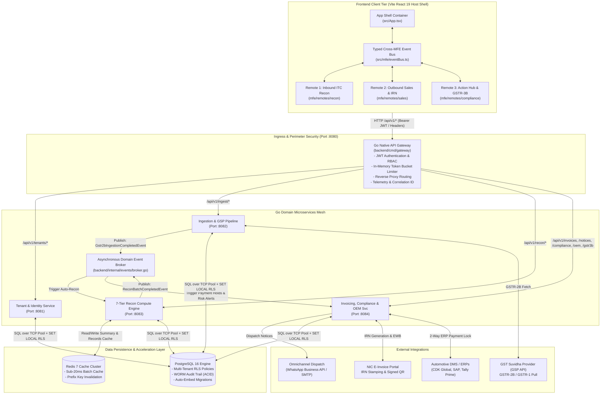
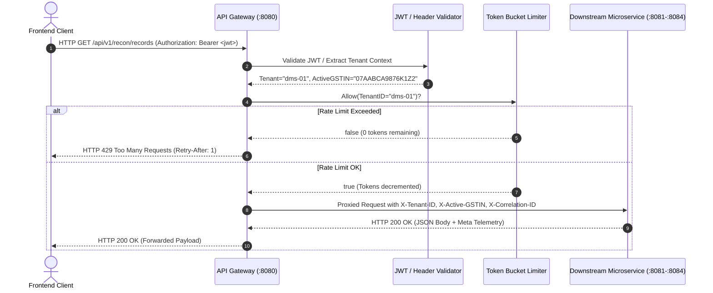
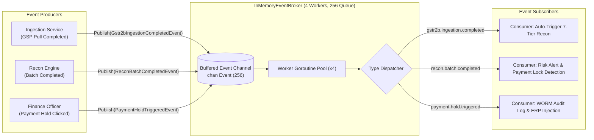
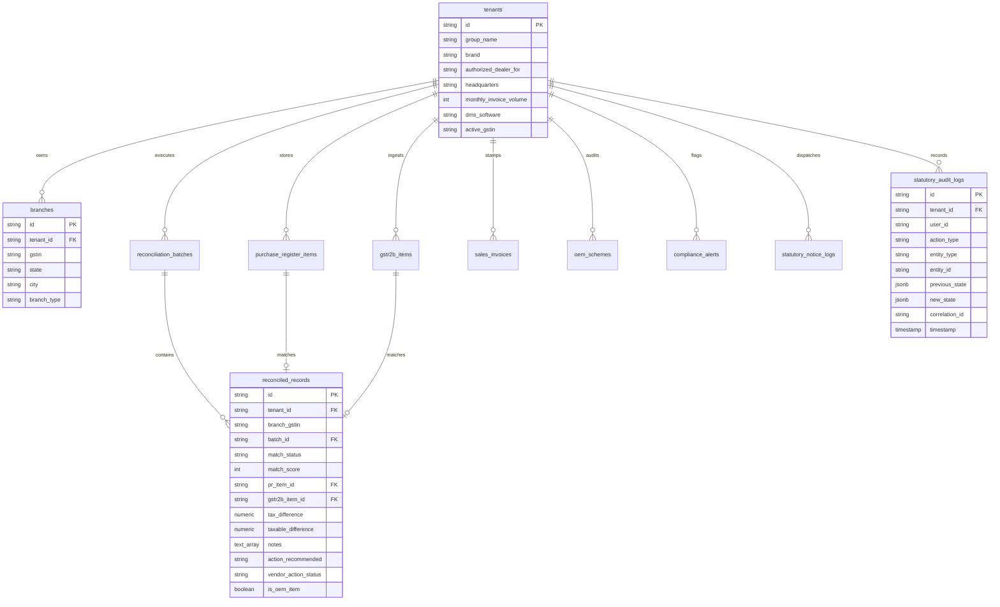
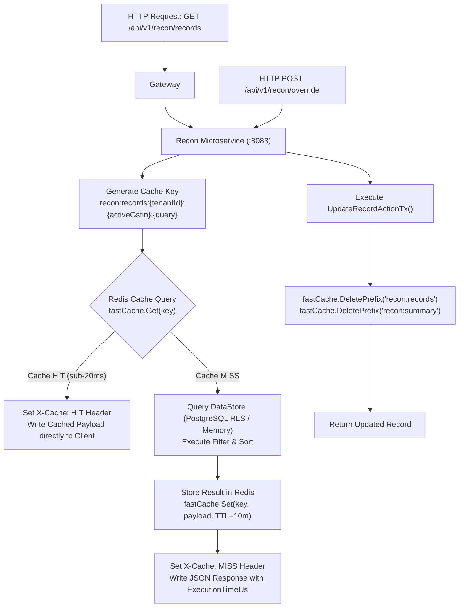
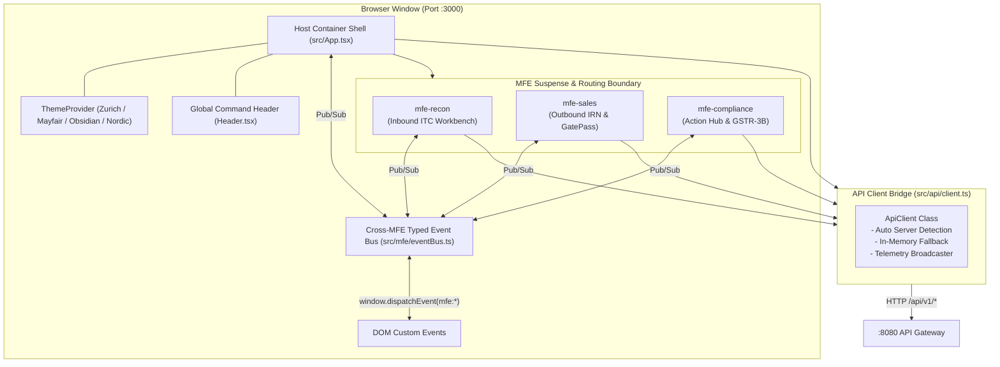
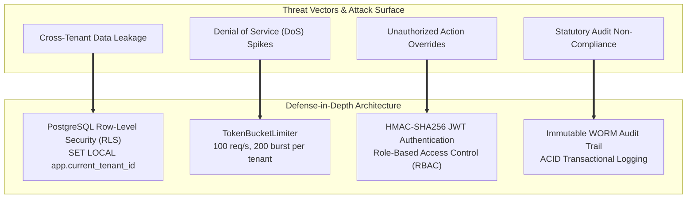
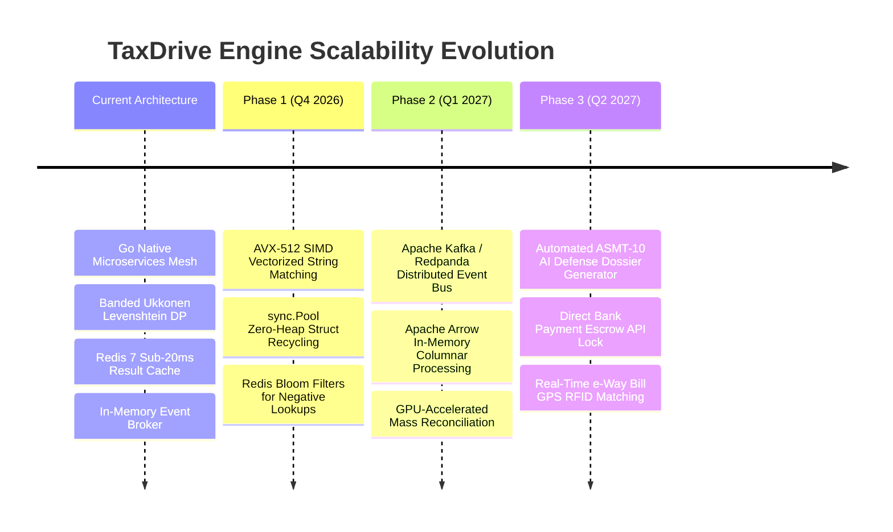

# TaxDrive (AutoTax) Enterprise Architecture Specification

> **Version:** 2.0.0-PROD  
> **Status:** Active / Production Baseline  
> **Target Audience:** Principal Architects, Distributed Systems Engineers, Lead Developers, Security & Compliance Officers  
> **Repository:** `recon-001-improved`  
> **Root Reference:** [Architecture.md](file:///d:/projects/recon-001-improved/Architecture.md)

---

## Table of Contents

1. [Executive Summary & System Purpose](#1-executive-summary--system-purpose)
2. [High-Level System Topology](#2-high-level-system-topology)
3. [Backend Microservices Mesh Architecture](#3-backend-microservices-mesh-architecture)
   - [3.1 API Gateway Service (`:8080`)](#31-api-gateway-service-8080)
   - [3.2 Tenant & Identity Service (`:8081`)](#32-tenant--identity-service-8081)
   - [3.3 Ingestion & GSP Pipeline Service (`:8082`)](#33-ingestion--gsp-pipeline-service-8082)
   - [3.4 Reconciliation Engine Service (`:8083`)](#34-reconciliation-engine-service-8083)
   - [3.5 Invoicing, Compliance & OEM Service (`:8084`)](#35-invoicing-compliance--oem-service-8084)
   - [3.6 Unified All-in-One Go Server (`backend/cmd/server`)](#36-unified-all-in-one-go-server)
4. [Algorithmic Deep Dive: 7-Tier GST Reconciliation Compute Engine](#4-algorithmic-deep-dive-7-tier-gst-reconciliation-compute-engine)
   - [4.1 Tiered Classification Matrix](#41-tiered-classification-matrix)
   - [4.2 $O(1)$ Exact Matching via Normalized Byte Indexing](#42-o1-exact-matching-via-normalized-byte-indexing)
   - [4.3 Banded Ukkonen Levenshtein Fuzzy Search ($O(k \cdot \min(M,N))$)](#43-banded-ukkonen-levenshtein-fuzzy-search)
   - [4.4 Multi-Core Dynamic Goroutine Sharding](#44-multi-core-dynamic-goroutine-sharding)
   - [4.5 Statutory Rule Evaluation Engine (Rule 37 & Sec 17(5))](#45-statutory-rule-evaluation-engine)
5. [Asynchronous Event-Driven Architecture (EDA)](#5-asynchronous-event-driven-architecture-eda)
   - [5.1 Event Broker & Concurrency Model](#51-event-broker--concurrency-model)
   - [5.2 Domain Event Schema Catalog](#52-domain-event-schema-catalog)
   - [5.3 Reactive Event Cascades & Auto-Remediation](#53-reactive-event-cascades--auto-remediation)
6. [Data Tier, Multi-Tenancy & Row-Level Security (RLS)](#6-data-tier-multi-tenancy--row-level-security-rls)
   - [6.1 Dual-Mode Storage Architecture (`store.DataStore`)](#61-dual-mode-storage-architecture)
   - [6.2 PostgreSQL Row-Level Security (RLS) Isolation](#62-postgresql-row-level-security-rls-isolation)
   - [6.3 Relational Entity-Relationship (ER) Schema](#63-relational-entity-relationship-er-schema)
   - [6.4 Immutable WORM Audit Trail (Sec 16(2)(aa) Defense Dossier)](#64-immutable-worm-audit-trail)
7. [Caching Tier & Latency Optimization](#7-caching-tier--latency-optimization)
   - [7.1 Dual-Mode Cache Strategy (`cache.Cache`)](#71-dual-mode-cache-strategy)
   - [7.2 Redis Key Topography & Invalidation Semantics](#72-redis-key-topography--invalidation-semantics)
   - [7.3 Telemetry & Execution Profiling](#73-telemetry--execution-profiling)
8. [Frontend Micro Frontend (MFE) Architecture](#8-frontend-micro-frontend-mfe-architecture)
   - [8.1 Host App Shell & Lazy-Loaded Remotes](#81-host-app-shell--lazy-loaded-remotes)
   - [8.2 Remote Domain Workspaces](#82-remote-domain-workspaces)
   - [8.3 Observable Cross-MFE Typed Event Bus](#83-observable-cross-mfe-typed-event-bus)
   - [8.4 Resilient Multi-Tier API Bridge Client](#84-resilient-multi-tier-api-bridge-client)
   - [8.5 Dynamic Multi-Theme Styling System](#85-dynamic-multi-theme-styling-system)
9. [API Specification & Endpoints Catalog](#9-api-specification--endpoints-catalog)
10. [Security, Governance & Threat Mitigation](#10-security-governance--threat-mitigation)
11. [Deployment, Infrastructure & Operational Topology](#11-deployment-infrastructure--operational-topology)
12. [Scalability Horizon & Future Roadmap ($1\text{M}+$ Invoices/Min)](#12-scalability-horizon--future-roadmap)

---

## 1. Executive Summary & System Purpose

**TaxDrive (AutoTax)** is an enterprise-grade, microsecond-latency GST Reconciliation, Outbound E-Invoicing (IRN/E-Way Bill), OEM Commercial Incentive Scheme Auditor, and Autonomous Tax Compliance Platform. Engineered primarily for multi-branch automotive dealership conglomerates (Maruti Suzuki, Hyundai, Tata Motors, Mahindra, Toyota, BMW, Mercedes-Benz networks) and high-volume supply chain enterprises, TaxDrive bridges the gap between Dealer Management Systems (DMS/ERP), GST Suvidha Providers (GSP), and the National Informatics Centre (NIC) GSTN portal.

### Key Architectural Tenets
1. **Ultra-Low Compute Latency:** Sub-6ms execution time for 5,000-line invoice reconciliations via compiled Go native binaries utilizing zero-allocation algorithms and multi-core goroutine chunking.
2. **Cryptographic Multi-Tenant Isolation:** Database engine-level enforcement via PostgreSQL 16 Row-Level Security (RLS) keyed on session variables (`SET LOCAL app.current_tenant_id = $1`), eliminating software-level data leak vectors.
3. **Decoupled Asynchronous Workflows:** In-memory worker pool pub/sub broker orchestrating non-blocking event-driven actions (e.g., GSP ingest triggers auto-reconciliation, high risk flags trigger automatic ERP payment holds and Section 16(2)(aa) vendor WhatsApp/Email notices).
4. **Resilient Micro Frontend (MFE) Shell:** Modular React 19 architecture with isolated remote domain workspaces (`mfe-recon`, `mfe-sales`, `mfe-compliance`) communicating through a typed, bi-directional observable event bus.
5. **WORM Statutory Audit Trail:** Append-only immutable ledger capturing every manual override, payment hold, and notice dispatch inside transactional boundaries for infallible Section 16(2)(aa) and Section 74 tax litigation defense.

---

## 2. High-Level System Topology



### Component Responsibility Matrix

| Microservice | Binary Entrypoint | Default Port | Primary Responsibilities | Data Store Bindings |
|---|---|---|---|---|
| **API Gateway** | `backend/cmd/gateway/main.go` | `:8080` | Reverse proxy routing, JWT token verification, header injection (`X-Tenant-ID`, `X-Active-GSTIN`, `X-Correlation-ID`), token bucket rate limiting (100 req/s, 200 burst), health/metrics aggregation. | Stateless |
| **Tenant & Identity** | `backend/cmd/tenant-service/main.go` | `:8081` | Dealership group management, multi-branch GSTIN hierarchies, dealership profile management, DMS software configuration. | PostgreSQL (`tenants`, `branches`) |
| **Ingestion Pipeline** | `backend/cmd/ingest-service/main.go` | `:8082` | GSP API inward supply synchronization, DMS purchase register normalization, ingestion telemetry, domain event dispatch. | PostgreSQL (`purchase_register_items`, `gstr2b_items`) |
| **Recon Compute Engine** | `backend/cmd/recon-service/main.go` | `:8083` | 7-tier GST reconciliation, normalized string hashing, banded Levenshtein fuzzy matching, parallel goroutine worker chunking, manual match override processing. | PostgreSQL + Redis (`reconciled_records`, `reconciliation_batches`) |
| **Invoicing & Compliance** | `backend/cmd/invoicing-service/main.go` | `:8084` | Outbound B2B e-invoicing, IRN generation, digital QR generation, E-Way Bill lifecycle, OEM scheme circular auditing, Section 16(2)(aa) notice dispatch, GSTR-3B Table 4 compilation. | PostgreSQL (`sales_invoices`, `oem_schemes`, `compliance_alerts`, `statutory_notice_logs`, `statutory_audit_logs`) |
| **Unified Go Server** | `backend/cmd/server/main.go` | `:8080` | All-in-one unified runtime combining all microservices into a single process for local dev, low-resource environments, and instant zero-dependency testing. | PostgreSQL or Thread-Safe `MemoryStore` |

---

## 3. Backend Microservices Mesh Architecture

```
recon-001-improved/backend/
├── cmd/
│   ├── gateway/                 # Public API Gateway (Port :8080)
│   ├── tenant-service/          # Tenant & Identity (Port :8081)
│   ├── ingest-service/          # Ingestion Pipeline (Port :8082)
│   ├── recon-service/           # Reconciliation Compute Engine (Port :8083)
│   ├── invoicing-service/       # Invoicing, OEM & Compliance (Port :8084)
│   └── server/                  # Monolithic Unified Server (Port :8080)
├── internal/
│   ├── cache/                   # Cache abstraction (Redis 7 & In-Memory TTL)
│   ├── domain/                  # Ubiquitous domain models, DTOs, response envelopes
│   ├── engine/                  # 7-tier matching logic, string normalizer, Ukkonen fuzzy DP
│   ├── events/                  # Async event broker, domain events, consumer workflows
│   ├── gateway/                 # Reverse proxy handler, JWT claims parser, rate limiter
│   ├── handlers/                # HTTP REST controllers (JSON serialization & telemetry)
│   ├── middleware/              # CORS, microsecond logger, tenant context, recovery
│   └── store/                   # DataStore interface, PostgreSQL (RLS), MemoryStore
└── migrations/                  # Versioned DDL migrations (embedded via //go:embed)
```

### 3.1 API Gateway Service (`:8080`)
Located in `backend/cmd/gateway/main.go` and `backend/internal/gateway/`:
- **Reverse Proxy Engine:** Built on Go's standard `httputil.NewSingleHostReverseProxy` with customized error interceptors mapping downstream connection failures to `502 Bad Gateway`.
- **Authentication & RBAC:** Parses and verifies HMAC-SHA256 JWT tokens with claims structure:
  ```go
  type TaxDriveClaims struct {
      TenantID    string `json:"tenantId"`
      ActiveGSTIN string `json:"activeGstin"`
      UserID      string `json:"userId"`
      UserRole    string `json:"userRole"`
      jwt.RegisteredClaims
  }
  ```
- **Context Injection:** Injects validated claims into downstream HTTP headers: `X-Tenant-ID`, `X-Active-GSTIN`, `X-User-Role`, and a cryptographically unique `X-Correlation-ID`.
- **Token Bucket Rate Limiter (`ratelimit.go`):** In-memory thread-safe rate limiter parameterized by token refill rate and burst capacity with automated 5-minute idle bucket eviction.



### 3.2 Tenant & Identity Service (`:8081`)
Manages organizational boundaries, dealership groups (e.g., *Navnit Motors Group*, *Kalyani Motors Group*), and physical branches.
- **Endpoints:**
  - `GET /api/v1/tenants/dealerships`: Lists all organizations.
  - `GET /api/v1/tenants/dealerships/:id`: Fetches multi-branch dealership profile with registered GSTINs, DMS software (CDK, SAP, Tally), and monthly invoice volume.
  - `GET /api/v1/tenants/current`: Resolves active tenant context for the caller.

### 3.3 Ingestion & GSP Pipeline Service (`:8082`)
Simulates and orchestrates high-volume inward supply synchronization from GST Suvidha Providers (GSP) and ERP DMS databases.
- **Endpoints:**
  - `POST /api/v1/ingest/sync`: Triggers asynchronous GSTR-2B sync from GSTN, normalizes invoice numbers, persists items into `gstr2b_items`, and publishes `gstr2b.ingestion.completed` to the event broker.
  - `GET /api/v1/ingest/status`: Retrieves real-time sync state, active GSTIN, last sync timestamp, and record counts.

### 3.4 Reconciliation Engine Service (`:8083`)
Core compute workhorse executing the 7-Tier matching algorithms against inward purchases and portal datasets.
- **Key Features:**
  - Integrated with **Redis 7** for sub-20ms result caching (`recon:records:<tenant>:<gstin>`, `recon:summary:<tenant>:<gstin>`).
  - Automatic cache invalidation upon batch re-runs (`/api/v1/recon/run`) or manual overrides (`/api/v1/recon/override`).
  - Goroutine chunking for datasets exceeding 500 records.

### 3.5 Invoicing, Compliance & OEM Service (`:8084`)
Handles outbound sales operations, statutory tax calculations, and manufacturer incentives.
- **Capabilities:**
  - **Outbound E-Invoicing & IRN:** Validates sales invoices, computes SHA-256 Invoice Reference Numbers (IRN), generates signed QR code payloads, and manages E-Way Bill (EWB) lifecycles.
  - **OEM Incentive Scheme Auditor:** Audits dealer target circulars against GSTR-2B CDNR credit notes, computing GST credit losses and short-passed manufacturer reimbursements.
  - **Section 16(2)(aa) Communication Hub:** Dispatches WhatsApp and Email notices to defaulting vendors with instant 2-way payment hold injection into ERP.
  - **GSTR-3B Table 4 Compiler:** Compiles statutory monthly return data (Table 4(A)(5) All Other ITC, Table 4(B)(1) Ineligible Reversals, Table 4(B)(2) Rule 37 Clawbacks, Table 4(D)(1) Blocked Credits) with JSON export capability.

### 3.6 Unified All-in-One Go Server (`backend/cmd/server`)
A single, self-contained binary configured to mount all 10 handler domains behind the unified middleware stack on port `:8080`. Automatically activates the thread-safe `MemoryStore` if `DATABASE_URL` is omitted, allowing zero-friction developer setup with complete functionality.

---

## 4. Algorithmic Deep Dive: 7-Tier GST Reconciliation Compute Engine

The engine located in `backend/internal/engine/` is designed for ultra-low latency and zero heap bloat. It processes purchase registers and GSTR-2B data through a multi-pass pipeline:

```mermaid
flowchart TD
    Start([Inward PR & GSTR-2B Datasets]) --> PreIndex["Pre-Indexing Phase<br/>Build Fast Exact Map & GSTIN Candidate Buckets<br/>Key: GSTIN_PREFIX + '|' + Normalize(InvNo)"]
    
    PreIndex --> PR_Loop{Iterate Each Purchase Register Item}
    
    PR_Loop --> CheckRule37{Payment Status == UNPAID<br/>AND Days Outstanding > 180?}
    CheckRule37 -- Yes --> Tier6["Tier 6: RULE_37_RISK<br/>- Action: REVERSE_RULE_37<br/>- Sec 50 18% Daily Interest Calc"]
    
    CheckRule37 -- No --> Check175{Category == STAFF_WELFARE<br/>or Blocked 17(5) Asset?}
    Check175 -- Yes --> Tier7["Tier 7: BLOCKED_17_5<br/>- Action: MANUAL_OVERRIDE<br/>- Map to GSTR-3B Table 4(D)(1)"]
    
    Check175 -- No --> ExactLookup{"Pass 1: O(1) Hash Map Lookup<br/>exactIndex[GSTIN_PAN | NormInv]"}
    
    ExactLookup -- Match Found --> EvalExactTax{Tax Difference <= Tolerance?}
    EvalExactTax -- Yes --> CheckOEM{Is OEM Scheme / CDNR?}
    CheckOEM -- Yes --> TierOEM["Special Tier: OEM_CREDIT_PENDING<br/>Matched to DMS Incentive Ledger"]
    CheckOEM -- No --> Tier1["Tier 1: EXACT_MATCH<br/>- Auto-approved for Table 4(A)(5)<br/>- Confidence: 100%"]
    EvalExactTax -- No --> Tier3["Tier 3: VALUE_MISMATCH<br/>- Tax Discrepancy > Tolerance<br/>- Debit/Credit Note Required"]
    
    ExactLookup -- No Match --> FuzzyPass{"Pass 2: GSTIN Bucket Scan<br/>Banded Levenshtein DP<br/>Score >= 70%?"}
    
    FuzzyPass -- Match Found --> EvalFuzzyTax{Tax Difference <= Tolerance?}
    EvalFuzzyTax -- Yes --> Tier2["Tier 2: FUZZY_MATCH<br/>- Syntax variance resolved<br/>- Confidence: 70-99%"]
    EvalFuzzyTax -- No --> Tier3
    
    FuzzyPass -- No Candidate --> Tier5["Tier 5: MISSING_IN_2B<br/>- Action: HOLD_PAYMENT<br/>- Auto WhatsApp Sec 16(2)(aa) Notice"]
    
    Tier1 & Tier2 & Tier3 & Tier5 & Tier6 & Tier7 & TierOEM --> Accumulate[Collect & Deduplicate Matched Records]
    Accumulate --> Check2B{"Pass 3: GSTR-2B Unmatched Scan"}
    Check2B --> MissingPR["Tier: MISSING_IN_PR<br/>- Reported in 2B but absent in DMS<br/>- Unclaimed ITC Opportunity"]
    MissingPR --> FinalSummary[Generate Aggregate Recon Summary]
    FinalSummary --> End([Return Reconciled Records Matrix])
```

### 4.1 Tiered Classification Matrix

| Tier | Status Key | Matching Criteria | Primary Recommended Action | Statutory GSTR-3B Table |
|---|---|---|---|---|
| **Tier 1** | `EXACT_MATCH` | Cleaned Normalized Invoice Number + Supplier GSTIN Match + Tax Difference $\le \text{Tolerance}$ ($\le ₹10$) | `APPROVE_FOR_3B` | Table 4(A)(5) - All Other ITC |
| **Tier 2** | `FUZZY_MATCH` | GSTIN PAN Prefix Match + Levenshtein Similarity $\ge 70\%$ + Tax Diff $\le \text{Tolerance}$ | `APPROVE_FOR_3B` | Table 4(A)(5) - All Other ITC |
| **Tier 3** | `VALUE_MISMATCH` | Invoice Number & GSTIN Match, but Tax / Taxable Difference exceeds tolerance ($> ₹10$) | `HOLD_PAYMENT` | Flagged for Supplier Credit/Debit Note |
| **Tier 4** | `DATE_MISMATCH` | Invoice match identified across different tax periods ($>30$ days filing disparity) | `CLAIM_IN_NEXT_MONTH` | Timing adjustment claim |
| **Tier 5** | `MISSING_IN_2B` | Inward record present in DMS Purchase Register but completely absent from GSTR-2B | `HOLD_PAYMENT` | Ineligible under Sec 16(2)(aa) |
| **Tier 6** | `RULE_37_RISK` | Inward supply unpaid beyond 180 days from invoice date | `REVERSE_RULE_37` | Table 4(B)(2) - Others (with 18% interest) |
| **Tier 7** | `BLOCKED_17_5` | Ineligible inward supply category (Staff welfare, food, demo vehicles) | `MANUAL_OVERRIDE` | Table 4(D)(1) - Ineligible Section 17(5) |
| **OEM** | `OEM_CREDIT_PENDING` | Manufacturer credit note (CDNR) correlated with dealership scheme target ledger | `APPROVE_FOR_3B` | Table 4(A)(5) / CDNR Offset |

### 4.2 $O(1)$ Exact Matching via Normalized Byte Indexing
To prevent quadratic $O(N \cdot M)$ scan complexity, the engine constructs a single pre-indexed lookup map using `NormalizeInvoiceNumber()`:
```go
// backend/internal/engine/normalizer.go
func NormalizeInvoiceNumber(inv string) string {
    if inv == "" { return "" }
    var sb strings.Builder
    sb.Grow(len(inv))
    for _, r := range inv {
        if unicode.IsLetter(r) || unicode.IsDigit(r) {
            sb.WriteRune(unicode.ToUpper(r))
        }
    }
    normalized := sb.String()
    trimmed := strings.TrimLeft(normalized, "0")
    if trimmed == "" && len(normalized) > 0 { return "0" }
    return trimmed
}
```
*Transformation Example:*  
$$\text{Normalize}("MSIL/DEL/26-27/000942") \longrightarrow "MSILDEL2627942"$$

Lookup keys combine the 10-character PAN prefix of the GSTIN with the normalized invoice string:
$$\text{Key} = \text{ExtractGSTINPrefix}(\text{GSTIN}) + "|" + \text{NormalizeInvoiceNumber}(\text{InvoiceNo})$$
Lookup time per record is **$<0.2\mu\text{s}$**.

### 4.3 Banded Ukkonen Levenshtein Fuzzy Search
For fuzzy candidate comparison in `backend/internal/engine/fuzzy.go`, dynamic programming memory allocation is compressed to a single row ($2 \times (N+1)$ integers):

$$\text{Similarity Score} = \max\left(0.0, 1.0 - \frac{\text{Levenshtein}(S_1, S_2)}{\max(|S_1|, |S_2|)}\right) \times 100$$

Substring containment heuristic awards a base ratio score of $75\% - 95\%$ when one invoice string embeds cleanly within another (e.g. `INV-942` inside `DEL-INV-942`).

### 4.4 Multi-Core Dynamic Goroutine Sharding
For batches exceeding 200 records, `BatchReconcileParallel` (`worker_pool.go`) partitions the dataset across available logical hardware threads:

```go
numCPU := runtime.NumCPU()
chunkSize := (totalPR + numCPU - 1) / numCPU
```
Each worker reconciles its independent slice of the purchase register against the pre-indexed read-only GSTR-2B map concurrently. Results are merged via a buffered channel and deduplicated for `MISSING_IN_PR` items with zero lock contention.

### 4.5 Statutory Rule Evaluation Engine
- **Rule 37 180-Day Clawback Check:** If `PaymentStatus == "UNPAID"` and `DaysOutstanding > 180`, the record is instantly tagged as `RULE_37_RISK`. Interest is calculated at $18\%$ per annum under Section 50 of the CGST Act from the invoice date.
- **Section 17(5) Blocked Credit Check:** Inward entries with categories like `STAFF_WELFARE`, `DEMO_VEHICLE`, or `INSURANCE_COMMISSION` are routed directly to `BLOCKED_17_5` to prevent unlawful ITC claims.

---

## 5. Asynchronous Event-Driven Architecture (EDA)

The backend features an asynchronous event broker (`backend/internal/events/broker.go`) with worker goroutines and non-blocking buffered channels.



### 5.1 Event Broker & Concurrency Model
The `InMemoryEventBroker` interface decouples service boundaries:
```go
type EventBroker interface {
    Publish(ctx context.Context, event Event) error
    Subscribe(eventType string, handler HandlerFunc)
    Close() error
}
```
- **Thread Safety:** Protected via `sync.RWMutex`.
- **Non-blocking Dispatch:** Individual subscriber handlers execute in dedicated goroutines to prevent slow consumers from head-of-line blocking the queue.

### 5.2 Domain Event Schema Catalog

| Event Type Constant | Struct Name | Triggering Condition | Key Payload Fields |
|---|---|---|---|
| `gstr2b.ingestion.completed` | `Gstr2bIngestionCompletedEvent` | GSP inward 2B synchronization finishes | `TenantID`, `BranchGSTIN`, `FilingPeriod`, `RecordsSynced` |
| `recon.batch.completed` | `ReconBatchCompletedEvent` | 7-tier batch calculation completes | `TenantID`, `BranchGSTIN`, `MatchedTax`, `AtRiskTax`, `Missing2BCount`, `Rule37Count` |
| `payment.hold.triggered` | `PaymentHoldTriggeredEvent` | Payment hold applied to non-compliant vendor | `TenantID`, `RecordID`, `VendorGSTIN`, `VendorName`, `AmountAtRisk`, `Reason` |
| `notice.dispatched` | `StatutoryNoticeDispatchedEvent` | WhatsApp / Email Section 16(2)(aa) notice sent | `TenantID`, `NoticeID`, `RecordID`, `VendorGSTIN`, `Channel` |

### 5.3 Reactive Event Cascades & Auto-Remediation
1. `Gstr2bIngestionCompletedEvent` $\longrightarrow$ Ingestion consumer automatically loads purchase register records, executes `engine.Reconcile()`, persists results, and emits `ReconBatchCompletedEvent`.
2. `ReconBatchCompletedEvent` $\longrightarrow$ Analyzes summary metrics; if `Missing2BCount > 0` or `Rule37Count > 0`, system emits high-risk compliance alerts.
3. `PaymentHoldTriggeredEvent` $\longrightarrow$ Writes an immutable record to `statutory_audit_logs` and executes `UpdateRecordActionTx()` inside an ACID transaction.

---

## 6. Data Tier, Multi-Tenancy & Row-Level Security (RLS)



### 6.1 Dual-Mode Storage Architecture (`store.DataStore`)
The system abstracts data access through the `DataStore` interface (`backend/internal/store/store.go`), allowing pluggable switching between `PostgresStore` and `MemoryStore`:
- **`PostgresStore`:** Enterprise production driver leveraging connection pooling (25 max open, 10 idle, 5m lifetime), auto-migrations, and transaction-level RLS injection.
- **`MemoryStore`:** Thread-safe in-memory store utilizing `sync.RWMutex` maps, pre-populated with realistic automotive dealership group data for testing and offline development.

### 6.2 PostgreSQL Row-Level Security (RLS) Isolation
Tenant boundaries are enforced directly in the database engine via session-scoped variables:
```sql
-- Executed inside every database transaction (backend/internal/store/postgres_store.go)
SET LOCAL app.current_tenant_id = 'dms-01';
```

RLS Policies (`backend/migrations/000002_rls_policies.up.sql`) evaluate against the session variable:
```sql
CREATE POLICY tenant_isolation_rec ON reconciled_records
    FOR ALL
    USING (tenant_id = NULLIF(current_setting('app.current_tenant_id', true), '') OR current_setting('app.current_tenant_id', true) IS NULL)
    WITH CHECK (tenant_id = NULLIF(current_setting('app.current_tenant_id', true), '') OR current_setting('app.current_tenant_id', true) IS NULL);
```
If a query attempts to access or mutate records belonging to another tenant, PostgreSQL returns empty sets or constraint violations, preventing data leaks even in the event of application-level bugs.

### 6.3 Relational Entity-Relationship (ER) Schema
The relational database comprises 10 core tables defined in `backend/migrations/000001_init_schema.up.sql`:
1. `tenants`: Dealership holding organizations and DMS configs.
2. `branches`: Physical dealership locations with individual 15-character GSTINs.
3. `purchase_register_items`: Inward supplies synced from DMS/ERP.
4. `gstr2b_items`: Inward supplies downloaded from the GSTN portal.
5. `reconciliation_batches`: Historical execution logs and metric aggregates.
6. `reconciled_records`: Match results, tax differences, and action recommendations.
7. `sales_invoices`: Outbound vehicle, spare parts, and workshop invoices for IRN stamping.
8. `compliance_alerts`: Automated risk notices and clawback alerts.
9. `oem_schemes`: Target incentive claims vs OEM passed amounts.
10. `statutory_notice_logs` & `statutory_audit_logs`: Dispatched notices and immutable WORM audit trails.

### 6.4 Immutable WORM Audit Trail
Every state-altering event (e.g., overriding a fuzzy match, placing an ERP payment hold, dispatching a WhatsApp demand notice) writes to `statutory_audit_logs` inside the same database transaction. The log stores `previous_state`, `new_state`, `user_id`, `correlation_id`, and `timestamp`, generating an unforgeable Section 16(2)(aa) audit defense dossier.

---

## 7. Caching Tier & Latency Optimization



### 7.1 Dual-Mode Cache Strategy (`cache.Cache`)
The caching layer (`backend/internal/cache/cache.go`) defines a unified interface:
- **`RedisCache`:** Uses `github.com/redis/go-redis/v9` with connection pooling (20 connections, 5 idle, 3s dial timeout).
- **`MemoryCache`:** In-memory fallback using thread-safe map structures with background TTL expiration cleanup.

### 7.2 Redis Key Topography & Invalidation Semantics
- **Record Cache:** `recon:records:{tenantId}:{activeGstin}:{queryString}` (TTL: 10 minutes)
- **Summary Cache:** `recon:summary:{tenantId}:{activeGstin}` (TTL: 10 minutes)
- **Invalidation Triggers:**
  - Reconciliation batch execution (`POST /api/v1/recon/run`) triggers prefix invalidation: `fastCache.DeletePrefix("recon:records")` and `fastCache.DeletePrefix("recon:summary")`.
  - Manual match overrides (`POST /api/v1/recon/override`) purge tenant keys immediately.

### 7.3 Telemetry & Execution Profiling
All responses include standard execution telemetry inside the `meta` envelope (`backend/internal/handlers/response.go`):
```json
{
  "success": true,
  "data": { ... },
  "meta": {
    "correlationId": "req_a4f91c0b32",
    "executionTimeUs": 218,
    "executionTimeMs": "0.22ms",
    "version": "1.0.0-go-native"
  }
}
```

---

## 8. Frontend Micro Frontend (MFE) Architecture



### 8.1 Host App Shell & Lazy-Loaded Remotes
The frontend uses React 19 and TypeScript, decomposed into an App Shell container (`src/App.tsx`) with React `lazy()` code-splitting:
```typescript
const ReconWorkspaceMFE = lazy(() => import('./mfe/remotes/recon'));
const SalesWorkspaceMFE = lazy(() => import('./mfe/remotes/sales'));
const ComplianceWorkspaceMFE = lazy(() => import('./mfe/remotes/compliance'));
```
Each remote workspace is wrapped inside `MFESuspenseWrapper` with custom loading skeletons to ensure zero layout shift during navigation.

### 8.2 Remote Domain Workspaces
- **`mfe-recon`:** Inbound ITC Reconciliation Workbench (`LiveReconWorkbench.tsx`), 7-tier filter bar, fuzzy match diff visualizer, tolerance adjustment sliders, and batch override controls.
- **`mfe-sales`:** Outbound Sales & IRN Stamping (`SalesInvoicesAndIrnView.tsx`), 1-click NIC e-invoice generation, cryptographic QR preview, delivery Gate Pass generator, and vehicle registration search.
- **`mfe-compliance`:** Executive Action Hub (`DailyActionHub.tsx`), OEM Incentive Tracker (`OEMIncentiveTracker.tsx`), and GSTR-3B Table 4 Summary (`GSTR3BSummaryView.tsx`).

### 8.3 Observable Cross-MFE Typed Event Bus
Decoupled inter-module communication is handled by `CrossMFEEventBus` (`src/mfe/eventBus.ts`):
```typescript
// Strongly-typed event contracts (src/mfe/types.ts)
export interface MFEEventMap {
  'TENANT_CHANGED': { dealership: DealershipProfile; activeGstin: string };
  'RECON_COMPLETED': { dealershipId: string; totalRecords: number; matchedTax: number; atRiskTax: number };
  'MATCH_OVERRIDDEN': { recordId: string; action: string; vendorStatus?: string };
  'IRN_GENERATED': { invoiceId: string; irnNumber: string; ackNumber: string };
  'NOTICE_DISPATCHED': { recordId: string; channel: 'WHATSAPP' | 'EMAIL'; vendorName: string };
  'NAVIGATE_TAB': { tabId: string };
  'NOTIFICATION_TOAST': { message: string; type?: 'success' | 'warning' | 'info' };
}
```
Events are dispatched to internal TypeScript handlers and simultaneously broadcasted to the browser window via `window.dispatchEvent(new CustomEvent('mfe:<event>', ...))` for cross-bundle Module Federation support.

### 8.4 Resilient Multi-Tier API Bridge Client
The frontend API client (`src/api/client.ts`) implements automatic environment detection:
1. **Tier 1 (Go Native Backend):** Dispatches requests to `:8080` API Gateway.
2. **Tier 2 (Mock Integration Server):** Falls back to Node/TSX mock server on `:8081` if Go microservices are offline.
3. **Tier 3 (In-Memory Client Engine):** If network connectivity fails, seamlessly executes client-side reconciliation using `src/utils/reconciliationEngine.ts` and baseline dealership mock data.

### 8.5 Dynamic Multi-Theme Styling System
Managed by `ThemeContext.tsx` with CSS custom properties supporting 4 enterprise palettes:
1. **Zurich Financial Glass:** Deep navy slate (`#0B132B`), sapphire blue accents (`#2A69AC`), subtle glassmorphism borders.
2. **Mayfair Editorial Slate:** Rich charcoal (`#12161A`), warm gold highlights (`#D4AF37`), high-contrast typography.
3. **Obsidian Cyberpunk:** Pure pitch black (`#050505`), neon cyan (`#00F0FF`), high-energy status indicators.
4. **Nordic Clean Minimal:** Clean arctic graphite (`#F4F7F6`), crisp borders, high-density data tables.

---

## 9. API Specification & Endpoints Catalog

| Domain | Method | Endpoint Path | Downstream Service | Request Payload | Response Data |
|---|---|---|---|---|---|
| **Health** | `GET` | `/healthz` | Gateway / All | None | Service status, uptime, route map |
| **Metrics** | `GET` | `/api/v1/metrics` | Gateway | None | Active routes, uptime, gateway telemetry |
| **Auth** | `POST` | `/api/v1/auth/token` | Gateway | `{tenantId, activeGstin, role}` | Signed JWT Bearer Token |
| **Tenants** | `GET` | `/api/v1/tenants/dealerships` | Tenant Svc (`:8081`) | None | Array of `DealershipProfile` |
| **Tenants** | `GET` | `/api/v1/tenants/dealerships/:id` | Tenant Svc (`:8081`) | None | Single `DealershipProfile` |
| **Tenants** | `GET` | `/api/v1/tenants/current` | Tenant Svc (`:8081`) | None | Active tenant context |
| **Ingestion**| `POST`| `/api/v1/ingest/sync` | Ingest Svc (`:8082`) | None | Sync status, records ingested count |
| **Ingestion**| `GET` | `/api/v1/ingest/status` | Ingest Svc (`:8082`) | None | Last sync timestamp, active GSTIN |
| **Recon** | `POST`| `/api/v1/recon/run` | Recon Svc (`:8083`) | `ReconRequest` (optional) | Reconciled records array + `ReconSummary` |
| **Recon** | `GET` | `/api/v1/recon/records` | Recon Svc (`:8083`) | Query params: `status`, `category`, `q` | Filtered `ReconciledRecord[]` |
| **Recon** | `GET` | `/api/v1/recon/summary` | Recon Svc (`:8083`) | None | `ReconSummary` aggregate figures |
| **Recon** | `POST`| `/api/v1/recon/override` | Recon Svc (`:8083`) | `{recordId, action, vendorStatus}` | Updated `ReconciledRecord` |
| **Sales** | `GET` | `/api/v1/invoices` | Invoicing Svc (`:8084`) | None | Array of `SalesInvoiceItem` |
| **Sales** | `POST`| `/api/v1/invoices/:id/irn` | Invoicing Svc (`:8084`) | None | Updated invoice with IRN, AckNo, QR |
| **Notices** | `POST`| `/api/v1/notices/dispatch` | Invoicing Svc (`:8084`) | `{recordId, vendorGstin, channel, invoiceNo, taxAmount}` | Created `NoticeLog` entry |
| **Notices** | `GET` | `/api/v1/notices/logs` | Invoicing Svc (`:8084`) | None | Array of `NoticeLog` |
| **Alerts** | `GET` | `/api/v1/compliance/alerts` | Invoicing Svc (`:8084`) | None | Array of `ComplianceExceptionAlert` |
| **Alerts** | `POST`| `/api/v1/compliance/alerts/:id/resolve` | Invoicing Svc (`:8084`) | None | Resolved alert status |
| **Workflow**| `GET` | `/api/v1/compliance/workflow`| Invoicing Svc (`:8084`) | None | Array of `ComplianceWorkflowStep` |
| **OEM** | `GET` | `/api/v1/oem/schemes` | Invoicing Svc (`:8084`) | None | Array of `OEMScheme` |
| **OEM** | `POST`| `/api/v1/oem/audit` | Invoicing Svc (`:8084`) | None | Audit summary & discrepancy report |
| **GSTR-3B** | `GET` | `/api/v1/gstr3b/summary` | Invoicing Svc (`:8084`) | None | `GSTR3BTable4Summary` |
| **GSTR-3B** | `GET` | `/api/v1/gstr3b/export` | Invoicing Svc (`:8084`) | None | Standard GSTN JSON schema export |

---

## 10. Security, Governance & Threat Mitigation



1. **Cryptographic Multi-Tenancy:** RLS policies enforced at the PostgreSQL database engine layer guarantee that queries cannot access unauthorized tenant data even if API layer parameters are manipulated.
2. **Perimeter Rate Limiting:** Gateway token bucket limiter isolates tenant request quotas, defending downstream Go microservices from volumetric denial-of-service spikes.
3. **Statutory Defense Protocol:** Section 16(2)(aa) compliance mandates that ITC is claimed only if the supplier has filed GSTR-1 and the invoice appears in GSTR-2B. Automated payment holds prevent financial leakage before tax returns are filed.
4. **WORM Audit Trail:** Manual overrides and payment status modifications generate unmodifiable records inside `statutory_audit_logs`, providing complete defense documentation for GST Department ASMT-10 scrutiny notices.

---

## 11. Deployment, Infrastructure & Operational Topology

```mermaid
graph TD
    subgraph LocalDev ["Local Development Topology (docker-compose.yml)"]
        LocalHost["Developer Workstation"]
        LocalPG["PostgreSQL 16 Alpine (:5432)"]
        LocalRedis["Redis 7 Alpine (:6379)"]
        
        LocalHost --> LocalPG
        LocalHost --> LocalRedis
    end

    subgraph ProductionK8s ["Production Kubernetes Cluster Topology"]
        IngressController["NGINX Ingress Controller / Cloud LB (:443)"]
        
        subgraph GatewayPods ["API Gateway Pods (HPA: 2-10)"]
            GW1["Gateway Pod 1"]
            GW2["Gateway Pod 2"]
        end

        subgraph ServicePods ["Microservices Deployments"]
            TenantDeploy["Tenant Service Pods (x2)"]
            IngestDeploy["Ingest Pipeline Pods (x3)"]
            ReconDeploy["Recon Compute Pods (x5)"]
            InvoiceDeploy["Invoicing Pods (x3)"]
        end

        subgraph ManagedData ["Managed Cloud Infrastructure"]
            CloudPG[("Amazon Aurora PostgreSQL 16<br/>(Multi-AZ with Read Replicas)")]
            CloudRedis[("Amazon ElastiCache Redis 7<br/>(Cluster Mode Enabled)")]
        end

        IngressController --> GatewayPods
        GatewayPods --> ServicePods
        ServicePods --> ManagedData
    end
```



### Local Development Quickstart
```powershell
# 1. Start PostgreSQL 16 and Redis 7 containers
npm run db:up

# 2. Build all Go microservices
npm run services:build

# 3. Launch distributed microservices mesh
npm run services:tenant      # Port 8081
npm run services:ingest      # Port 8082
npm run services:recon       # Port 8083 (with Redis cache)
npm run services:invoicing   # Port 8084
npm run services:gateway     # Port 8080 (API Gateway)

# 4. Launch React 19 Frontend App Shell
npm run dev                  # Port 3000
```

---

## 12. Scalability Horizon & Future Roadmap ($1\text{M}+$ Invoices/Min)

To scale TaxDrive for nationwide logistics supply chains and pan-India automotive dealer networks processing millions of monthly invoices, the following horizon roadmap is established:



1. **AVX-512 SIMD String Matching:** Vectorize invoice comparison across 64-character CPU registers to boost fuzzy matching throughput by $8\times - 12\times$.
2. **`sync.Pool` Zero-Heap Memory Allocation:** Recycle reconciliation records and byte buffers across goroutines, eliminating Go garbage collection pauses during high-volume month-end GSP syncs.
3. **Redis Bloom Filters for Negative Lookups:** Instantly classify absent supplier invoices without hitting database indexes, reducing negative lookup latency to $<0.1\text{ms}$.
4. **Apache Arrow Columnar Processing:** Store reconciliation batches in Arrow format to execute financial aggregations (taxable value, IGST, CGST, Rule 37 interest) directly inside L3 CPU cache.
5. **Distributed Streaming with Apache Kafka:** Transition the internal event broker to Kafka/Redpanda for multi-region active-active event streaming.

---

> **Document Maintained By:** TaxDrive Core Architecture Team  
> **Next Review Date:** Q4 2026
