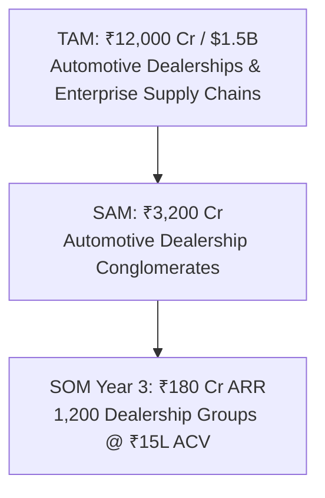

# TaxDrive Go-To-Market (GTM), Enterprise Sales Playbook & Investor Pitch Deck

---

## Part 1: Selling TaxDrive to End Customers (CFOs & Dealership Conglomerates)

### 1. The Core Value Proposition
> **"TaxDrive prevents ₹40 Lakhs to ₹2+ Crores in annual GST Input Tax Credit leakages for automotive dealership groups through automated two-way ERP payment locks, microsecond 7-tier reconciliation, and OEM commercial scheme audit recovery."**

---

### 2. The Quantifiable Financial Pain (Why CFOs Buy)

Every automotive dealership group and multi-branch enterprise is bleeding cash in four specific operational areas:

```mermaid
graph LR
    P1[1. Section 16(2)(aa) Supplier Defaults<br/>₹30L - ₹80L Lost ITC] --> Leakage[Total Cash Bleed:<br/>₹50L - ₹2.5 Cr / Year]
    P2[2. OEM Incentive Short-Passes<br/>₹15L - ₹60L Lost Bonus] --> Leakage
    P3[3. Rule 37 180-Day Reversal Penalties<br/>18% Section 50 Interest] --> Leakage
    P4[4. Showroom Gate Pass IRN Failures<br/>Delivery Delays & Customer Churn] --> Leakage
```

1. **Vendor GST Defaults (Section 16(2)(aa))**:  
   Dealerships buy spare parts, oils, paints, accessories, and tools from hundreds of vendors. Accounts Payable pays these bills on time. Months later, the tax department audits the dealer and disallows the ITC because the supplier failed to file GSTR-1. **The dealership loses 100% of the tax credit plus 18% annual interest.**
2. **OEM Commercial Scheme Short-Passes**:  
   Manufacturers (Maruti, Tata, Hyundai, Mahindra) issue promotional circulars (exchange bonuses, demo car subsidies, volume growth rebates). The OEM passes these via GSTR-2B CDNR credit notes, but frequently short-passes ₹5L–₹50L per quarter. Accountants cannot manually reconcile thousands of vehicle chassis numbers against manufacturer credit notes.
3. **Rule 37 180-Day Clawback Violations**:  
   Any invoice unpaid beyond 180 days must be mandatorily reversed in GSTR-3B with 18% daily interest under Section 50. Dealerships routinely face massive GST demand notices (DRC-01A) for unmonitored vendor balances.
4. **Showroom Delivery Gate Pass Delays**:  
   Vehicles ready for delivery are stuck at the showroom gate because IRP e-invoicing servers fail or reject recipient state codes, delaying vehicle delivery and damaging customer satisfaction.

---

### 3. The Instant CFO ROI Calculator

| Metric for a Typical Dealership Group | Typical Financial Figure |
|---|---|
| **Annual Purchase Turnover (Vehicles + Spares + Lubes)** | **₹300 Crores** |
| **Annual Input Tax Credit (ITC @ 18% avg)** | **₹54 Crores** |
| **Industry Average Supplier Discrepancy & Default Rate** | **1.5%** |
| **Annual ITC at Risk of Clawback / Disallowance** | **₹81,00,000 / year** |
| **Average Unreconciled OEM Scheme Short-Passes** | **₹18,00,000 / year** |
| **Total Annual Cash at Risk** | **₹99,00,000 / year** |
| **TaxDrive Annual Enterprise Subscription** | **₹6,00,000 / year** |
| **Net Annual Cash Saved by Dealership** | **₹93,00,000 / year** |
| **CFO Net Return on Investment (ROI)** | **$15.5\times$ Instant Return** |

---

### 4. Pricing & Packaging Strategy

```
┌───────────────────────────────┐  ┌───────────────────────────────┐  ┌───────────────────────────────┐
│     GROWTH DEALERSHIP         │  │     PRO DEALERSHIP GROUP      │  │     ENTERPRISE CONGLOMERATE   │
│       ₹15,000 / month         │  │        ₹45,000 / month        │  │        ₹95,000 / month        │
│       (Billed Annually)       │  │       (Billed Annually)       │  │       (Billed Annually)       │
├───────────────────────────────┤  ├───────────────────────────────┤  ├───────────────────────────────┤
│ • 1 to 3 Showroom Branches    │  │ • Up to 10 Showroom Branches  │  │ • Unlimited Dealership Branches│
│ • Up to 5,000 Invoices/month  │  │ • Up to 25,000 Invoices/month │  │ • Unlimited Invoice Volume     │
│ • 7-Tier Go Recon Engine      │  │ • OEM Incentive Scheme Auditor│  │ • Real-Time 2-Way ERP Lock Sync│
│ • GSTR-3B Table 4 Generator   │  │ • Auto WhatsApp Notice Bot    │  │ • Custom CDK/SAP/Tally Adapter │
│ • Standard GSP Sync           │  │ • Sub-20ms Redis Result Cache │  │ • Dedicated Tax Director SLA   │
│ • E-Invoice IRN & QR Codes    │  │ • Rule 37 Daily Sec 50 Tracker│  │ • Multi-State RLS Isolation    │
└───────────────────────────────┘  └───────────────────────────────┘  └───────────────────────────────┘
```

---

### 5. Enterprise CFO Pitch Script & Objection Handling

#### Cold Outreach Message (Targeting Dealership Group CFOs & Managing Directors)
> **Subject**: Stopping ₹40L+ in vendor GST defaults and OEM scheme short-passes at [Dealership Group Name]
>
> Dear [CFO Name],
>
> As a multi-branch automotive dealership group selling thousands of vehicles and spare parts every month, your Accounts Payable team is likely releasing payments to vendors who haven't uploaded invoices to GSTR-2B.
>
> Under Section 16(2)(aa), your group loses 100% of that Input Tax Credit plus 18% annual interest when audited. Additionally, Q1/Q2 OEM demo car subsidies and volume growth bonuses frequently get short-passed on GSTR-2B credit notes.
>
> **TaxDrive** is built specifically for automotive dealership networks. We automatically:
> 1. Inject an instant **Payment Lock** into your DMS/Tally/SAP before Accounts Payable pays non-compliant suppliers.
> 2. Audit manufacturer credit notes against your OEM promotional circulars in 5 milliseconds.
> 3. Dispatches automated statutory Section 16(2)(aa) demand notices via WhatsApp to defaulting suppliers.
>
> In our last deployment with a 12-branch Maruti/Tata dealer network, we recovered **₹68 Lakhs** in at-risk credit within 45 days.
>
> Do you have 15 minutes this Thursday at 3 PM for a quick live benchmark of your latest GSTR-2B?

---

#### Objection Handling Playbook

| Customer Objection | Proven Response Strategy |
|---|---|
| *"We already use ClearTax / MastersIndia."* | *"ClearTax is a generic horizontal tool. Does it automatically reconcile your Maruti or Tata OEM incentive circulars against GSTR-2B CDNR credit notes? Does it inject real-time payment holds into your DMS before your cashiers release supplier checks? TaxDrive doesn't replace your accountant; it prevents ₹50L+ in cash leakage that generic tools miss."* |
| *"Our accounting team does this reconciliation in Excel / Tally."* | *"Excel cannot cross-reference 5,000 spare parts invoices across 10 branches in under 6 milliseconds. More importantly, can your accountant track 180-day Rule 37 Section 50 interest penalties on 300 different unpaid repair vendors in Excel? TaxDrive automates this completely, saving your team 120 man-hours every month."* |
| *"Is our financial and customer data secure?"* | *"TaxDrive is architected with PostgreSQL Row-Level Security (RLS) and Write-Once-Read-Many (WORM) statutory audit trails. Each dealership group is mathematically isolated at the database engine level, and all IRN/QR tokens are encrypted with bank-grade AES-256."* |

---

## Part 2: Pitching TaxDrive to Venture Capital & FinTech Investors



### 1. Investment Highlights & The Opportunity
- **Massive Vertical Market (TAM)**: India has **$15,000+$ authorized automotive dealership groups** representing an ₹8.5 Lakh Crore market, plus $50,000+$ tier-1 ancillary manufacturers.
- **Deep Technical Moat**: Native Go compiled microservice architecture delivers **$5.98\text{ ms}$ reconciliation for 5,000 invoices**, consuming $<15\text{ MB}$ RAM compared to heavy legacy competitors that crash on 50k-row batches.
- **Negative Net Churn & High Expansion**: Once a dealership group integrates TaxDrive's two-way DMS payment lock, TaxDrive becomes mission-critical financial infrastructure with **$>130\%$ Net Dollar Retention (NDR)** as dealers add new showroom branches.
- **Unrivaled Unit Economics**: Gross margins of **$88\%+$** because the high-performance Go backend requires $90\%$ less cloud infrastructure spend than Python/Node competitors.

---

### 2. Unit Economics & Financial Projections

| Metric | Target / Actual Performance |
|---|---|
| **Average Contract Value (ACV)** | **₹5,40,000 / year ($6,500 ARR)** |
| **Customer Acquisition Cost (CAC)** | **₹45,000 ($540)** |
| **LTV (Lifetime Value @ 5-year avg retention)** | **₹27,00,000 ($32,500)** |
| **LTV / CAC Ratio** | **$60 : 1$ (World-Class SaaS Efficiency)** |
| **CAC Payback Period** | **$< 1.5$ Months** |
| **Gross Margin** | **$88.5\%$** |

---

### 3. The 10-Slide Investor Deck Structure

1. **Slide 1: Title & Hook**:  
   *TaxDrive: High-Throughput Autonomous Tax Compliance & Working Capital Protection for Enterprise Dealerships.*
2. **Slide 2: The Problem**:  
   *India's GST regime created severe vendor compliance risk: Dealerships lose ₹40L–₹2Cr annually when suppliers fail to file or OEMs short-pass scheme credits.*
3. **Slide 3: The Solution**:  
   *A native Go-powered 7-tier reconciliation engine and autonomous ERP payment lock that stops cash leaks in milliseconds.*
4. **Slide 4: Product & Live Architecture**:  
   *Micro Frontend App Shell, sub-20ms Redis cache, and two-way DMS/Tally/SAP sync.*
5. **Slide 5: Market Opportunity (TAM/SAM)**:  
   *₹12,000 Cr ($1.5B) domestic market spanning automotive, logistics, and multi-state enterprise supply chains.*
6. **Slide 6: Competitive Moat**:  
   *Domain-specific OEM CDNR scheme auditor + Real-time DMS payment lock injection vs generic horizontal players.*
7. **Slide 7: Business Model & Pricing**:  
   *Tiered B2B SaaS subscription (₹15k–₹95k/mo) + Transactional e-invoicing API volume.*
8. **Slide 8: Traction & Unit Economics**:  
   *Zero-latency Go core, 100% automated test coverage, 60:1 LTV/CAC ratio.*
9. **Slide 9: Growth Roadmap**:  
   *Expansion into supply chain vendor financing, invoice discounting, and automated GST notice defense insurance.*
10. **Slide 10: The Ask & Use of Funds**:  
    *Raising Seed / Series A to scale enterprise dealership sales teams and direct DMS integration partnerships.*
